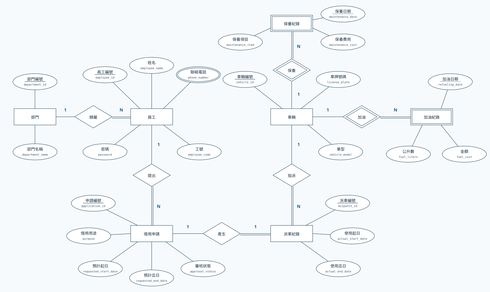
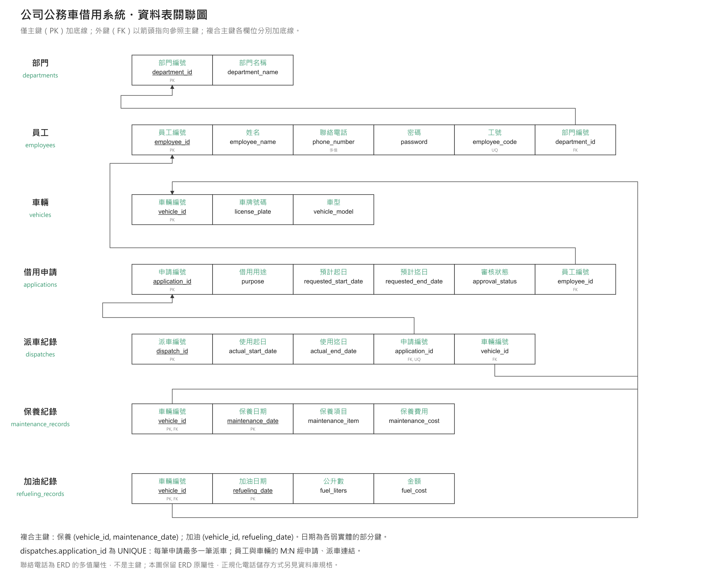
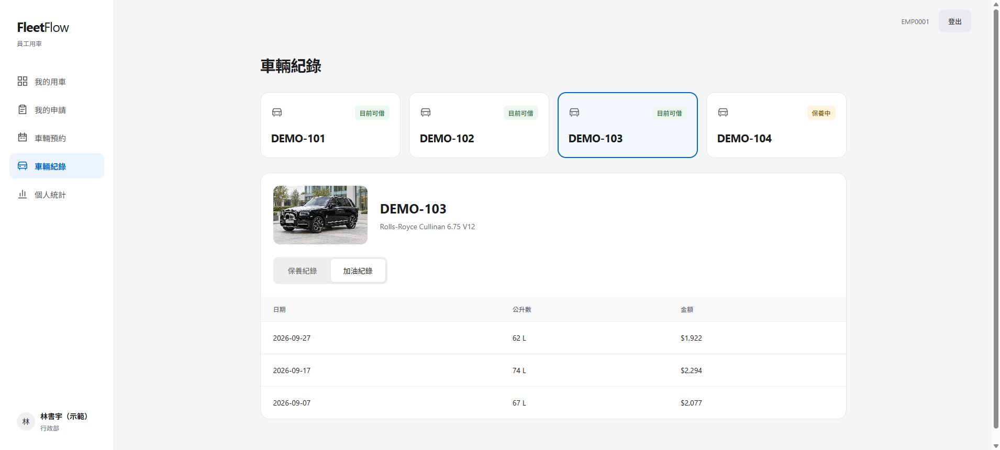

# FleetFlow｜公司公務車借用系統

以**工號與密碼登入**的公務車借用 demo。員工可新增、修改、查詢、取消、刪除自己的申請，登記歸還及查看個人統計；「車輛預約」可查看大家的用車安排並依起迄時間查空車。

[GPT Site](https://fleetflow-company-vehicles.davidsu881209.chatgpt.site) · [Public GitHub](https://github.com/Davidsuwj/fleetflow) · [完整規格](SPEC.md)

前端與 JavaScript Worker API 直接部署 GPT Sites，連線 PostgreSQL，不依賴 ngrok、Railway 或本機服務。Python FastAPI 參考版本保留。

## 功能

| 頁面 | 功能 |
|---|---|
| 員工登入 | employee_code＋password、持續登入、登出 |
| 我的用車 | 個人摘要、下一趟行程 |
| 我的申請 | 新增、修改、取消、刪單、搜尋及狀態篩選 |
| 車輛預約 | 大家的預約、指定起迄查空車 |
| 車輛紀錄 | 點選車牌查看該車車況，切換保養／加油紀錄 |
| 個人統計 | 申請／行程／歸還數、預約時數、近六個月數量 |

全車隊為 **Rolls-Royce Cullinan 6.75 V12**，以不同車牌識別。沒有管理者介面；申請有效且有空車時自動核准並派車。可指定車輛或自動安排。

## 時段防呆

區間採 [出發, 歸還)：若既有起日 < 新迄日，且既有有效迄日 > 新起日，即重疊。同台車與同員工的重疊行程都拒絕；相鄰時段允許。查空車僅反映查詢當下，送出時會在交易內鎖定員工與車輛，再次確認衝突。兩人同時指定同台車，最多一筆成功，另一筆 409，不會留下半套單據。

修改、取消、刪單只適用尚未開始及未歸還的預約；修改失敗保留原預約。取消保留申請、移除預約；刪單移除申請與預約。開始使用後可登記歸還。

## ERD 與關聯綱目



員工包含一般屬性 **password**，employee_id 仍為唯一 PK。保養及加油皆為弱實體，以日期為部分鍵，PK 分別為 (vehicle_id, maintenance_date)、(vehicle_id, refueling_date)。電話為多值屬性，不是 PK。



只有 PK 加底線；FK 箭頭指向參照 PK；複合 PK 欄位分別加底線，不畫下方括線。[綱目說明](docs/RELATIONAL_SCHEMA.md) · [SVG](docs/relational-schema.svg)。登入工作階段與限流表為實作支援表，主圖仍呈現七個領域實體。

## 網站畫面



## 本機建置

Node.js 22+、Python 3.11+、可連線 PostgreSQL。

```powershell
npm ci
python -m pip install -r requirements.txt
Copy-Item .env.example .env
# 填入本機環境變數，勿提交 .env。
python -c "from backend.db import migrate; migrate()"
python -m backend.seed_demo
python -m backend.seed_vehicle_records
python -m backend.employee_passwords --provision-missing
npm run dev
```

本機預覽 http://127.0.0.1:8770。初始員工密碼保存在被 Git 忽略的 `.local/員工登入資料.txt`；執行 provision-missing 只處理未設定密碼者，不覆寫既有密碼。重設指定員工：

```powershell
python -m backend.employee_passwords --reset EMP0001
```

新密碼以互動輸入，不放入命令列。重設會撤銷該員工既有登入。Python API 對照版以 `uvicorn backend.main:app --host 127.0.0.1 --port 8767` 執行；內部建置 API 另受 SERVICE_API_KEY 保護，不是正式網站相依服務。

## 資料與登入

PostgreSQL：140.117.68.35:5432，database／Maintenance DB／user 為 project_17，使用 fleetflow schema。DB_PASSWORD 只在本機 .env／Sites 秘密值保存。

依作業需求，員工密碼在 employees.password **明碼保存**，不使用雜湊。一般查詢、登入回應及共享預約均不回傳密碼。員工身分取自伺服器 session；改網址或 body 中 employee_id 無法存取他人私有資料。大家的預約頁僅共享車牌、姓名、用途、起迄時間；電話與個人統計不共享。

登入 session 最長 8 小時，使用 HttpOnly／SameSite=Strict Cookie，正式 HTTPS 加 Secure。登出及重設密碼撤銷 session；寫入需 CSRF token。同工號 15 分鐘內錯誤 5 次、同來源錯誤 30 次會限流。GPT Site 已設為 Public，任何取得連結者可開啟；系統資料仍需員工工號與密碼登入。

## 驗證

```powershell
npm test
npm run check
npm run build
python -m pytest -q
```

測試使用獨立 fleetflow_test_<12 hex> schema，涵蓋登入／登出／過期／CSRF／個人隔離、共享查空車、指定車輛重疊及併發、日期複合主鍵、migration rollback、刪單和歸還。CI 範本為 docs/CI_TEMPLATE.yml，尚未啟用 GitHub Actions。

## 文件與限制

[功能](docs/PRODUCT_SPEC.md) · [資料庫](docs/DATABASE_SPEC.md) · [API](docs/API_SPEC.md) · [安全](docs/SECURITY_SPEC.md) · [部署](docs/DEPLOYMENT_SPEC.md) · [測試](docs/TEST_SPEC.md) · [Python OpenAPI](docs/openapi.json)

尚無分頁、密碼找回或管理者介面。員工由建置工具建立；未設定密碼的員工不能登入。逾期未歸還不會自動延長原預約，直接 SQL 仍可繞過 API 業務檢查。此為課程 demo。

工號：`employees.employee_code` 為 UNIQUE 字串，格式 `EMP0001` 起，從 employee_id 產生（超過四碼不截斷）。登入只接受 employee_code＋password；數字流水號不能登入。employee_id 仍是內部 PK／FK，保留既有申請與派車關聯。工號不加 PK 底線。

「我的申請」集中顯示申請、車牌、使用期間、已預約／使用中／已歸還狀態與歸還操作。「申請用車」按鈕只出現在「我的申請」頁。

示範車輛 DEMO-101～104 各有 2 筆保養、3 筆加油資料。`python -m backend.seed_vehicle_records` 只補入固定歷史日期的模擬資料，依車輛／日期略過既有紀錄，不更動車況、申請或員工。
