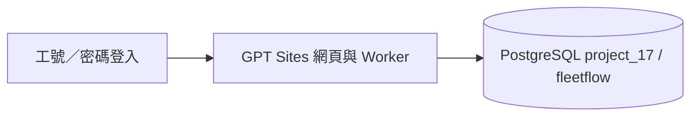

# FleetFlow 系統規格

依七實體 ERD，採員工個人登入。所有車輛統一 Rolls-Royce Cullinan 6.75 V12。

## 架構

JavaScript 為正式 Worker 後端；Python 為相同資料庫的參考 API。網站不需要本機服務或 ngrok，沒有管理者介面。

## 驗收條件

| ID | 條件 |
|---|---|
| AC01 | 以 employee_code＋password 登入、登出，員工表含一般 password 明碼欄位 |
| AC02 | 個人申請、行程、電話及統計由 session 員工決定，無員工切換選單 |
| AC03 | 新增／修改／刪單／取消／查詢／統計及歸還可用 |
| AC04 | 有效未來時段在同一交易自動核准與派車，不需管理者 |
| AC05 | 車輛預約呈現大家的車牌、姓名、用途及時段，能依起迄查空車 |
| AC06 | 可指定車輛；重疊時拒絕，併發兩人搶同台車最多一筆成功 |
| AC07 | 修改失敗保留原預約；取消／刪單釋放預約；已開始／歸還不可刪改 |
| AC08 | 車型 Cullinan、唯一車牌、保留既有生成圖片 |
| AC09 | 密碼為一般 ERD 屬性；兩日期為部分鍵，兩紀錄雙框及雙菱形；綱目只有 PK 底線，無下方括線 |
| AC10 | GitHub Public，main 一筆完整提交，程式與 README／SPEC 一致，不含真實密碼 |
| AC11 | 同一 GPT Site 發布成功，持久資料在 PostgreSQL |
| AC12 | 同車同日各一筆保養／加油；無保養序號或加油編號 |
| AC13 | HttpOnly Cookie、8 小時過期、CSRF、錯誤登入限流；一般 API 不回傳密碼 |
| AC14 | 車輛紀錄先選車，再顯示該車保養或加油資料；車牌及紀錄切換支援鍵盤與手機 |
| AC15 | 模擬保養／加油資料可重複匯入，既有車輛／日期資料不被覆寫 |

## 文件

[功能](docs/PRODUCT_SPEC.md) · [資料庫](docs/DATABASE_SPEC.md) · [API](docs/API_SPEC.md) · [安全](docs/SECURITY_SPEC.md) · [部署](docs/DEPLOYMENT_SPEC.md) · [測試](docs/TEST_SPEC.md) · [關聯綱目](docs/RELATIONAL_SCHEMA.md)
